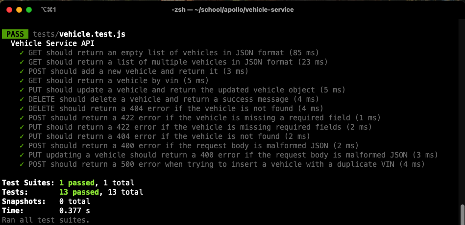

# Apollo Vehicle API Service

A RESTful API service for managing vehicle data using Node.js, Express, and PostgreSQL.

## Requirements

- Node.js (v14 or higher)
- PostgreSQL (v12 or higher)
- npm (Node Package Manager)

## How to set up

1. Clone the repository:
```bash
git clone https://github.com/sennetsen/vehicle-service.git
```

2. Install the necessary dependencies (based on the entities listed in package.json):
```bash
npm install
```
- Install homebrew (if not already installed) at https://brew.sh/
- Install Node.js using homebrew: `brew install node`
- Install PostgreSQL using homebrew: `brew install postgresql` OR download from https://www.postgresql.org/download/
- If using homebrew: start PostgreSQL service: `brew services start postgresql`
- Run `psql -U postgres` to access the psql shell. This will open a new shell to be used for initializing the database.


3. Create the PostgreSQL database as follows in the psql shell:
```sql
CREATE DATABASE vehicle_service;
```

4. Press `\q` to exit the psql shell. Now run `psql -U postgres -d vehicle_service` to access the vehicle_service database.

5. Create the vehicle table in the vehicle_service database:
```sql
CREATE EXTENSION IF NOT EXISTS citext;

CREATE TABLE vehicle (
    vin CITEXT PRIMARY KEY,
    manufacturer_name VARCHAR NOT NULL,
    description VARCHAR NOT NULL,
    horse_power INTEGER NOT NULL,
    model_name VARCHAR NOT NULL,
    model_year INTEGER NOT NULL,
    purchase_price DECIMAL(1000, 2) NOT NULL,
    fuel_type VARCHAR NOT NULL
);
```

6. Press `\q` to exit the psql shell.

7. Create a `.env` file in the project directory with the following environment variables by running `nano .env`:
```bash
DB_USER=postgres
DB_HOST=localhost
DB_NAME=vehicle_service
DB_PASSWORD=your_password
DB_PORT=5432
```
- Note: the default username and password for PostgreSQL is usually `postgres`.


8. Now the server is ready to start. Start it with the following command:
```bash
npm start
```

## Running Tests via Jest and Supertest in the Command Line

To run the test suite, run the following command in the terminal:
```bash
npm test
```



## Vehicle Service API Endpoints

### GET /vehicle
Returns a list of all vehicles in the database.

### GET /vehicle/{vin}
Returns a specific vehicle by searching for its VIN.

### POST /vehicle
Creates a new vehicle object. Required fields include:
- vin (case-insensitive string)
- manufacturer_name (string)
- description (string)
- horse_power (integer)
- model_name (string)
- model_year (integer)
- purchase_price (decimal)
- fuel_type (string)

### PUT /vehicle/{:vin}
Updates an existing vehicle. It requires the same fields as POST.

### DELETE /vehicle/{:vin}
Deletes a vehicle by searching for its VIN.

## Error Handling

The API returns the following HTTP status codes, as appropriate:
- 200: Success
- 201: Vehicle object created
- 400: Bad/misformed request
- 404: Vehicle object not found
- 422: Validation error
- 500: Internal server error
